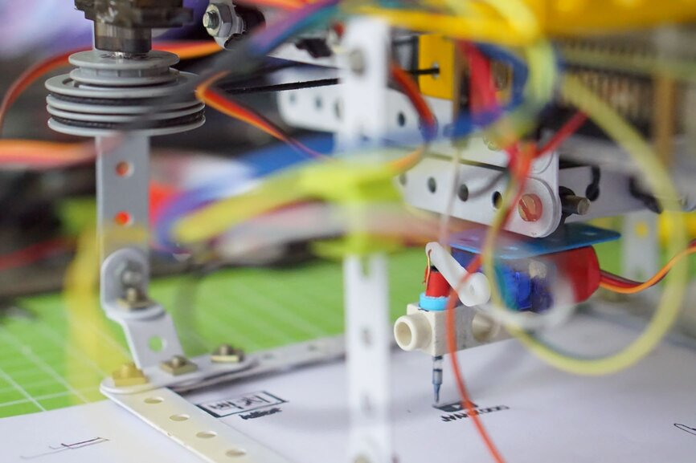
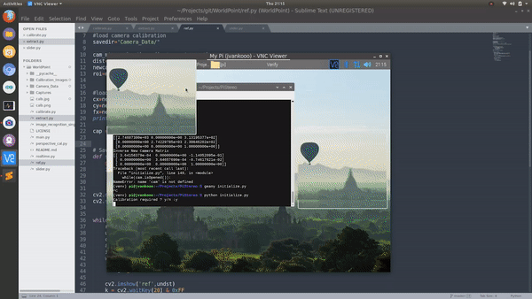
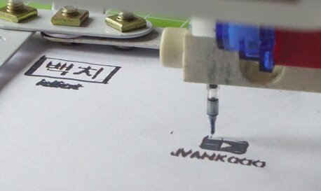

# PiPrinter
A Raspberry Pi wall printer (cnc plotter) made on a servo slider.

## Calibration Steps
* Camera Calibration (Fixes any camera distortion)
* Perspective Correction (Aligns real object with image)
* Pixel to Millimeter Scale (Calculates the ratio between real mesurements and image)

## Segmenting and Calibrating the Slider

  

## Watch The Video

